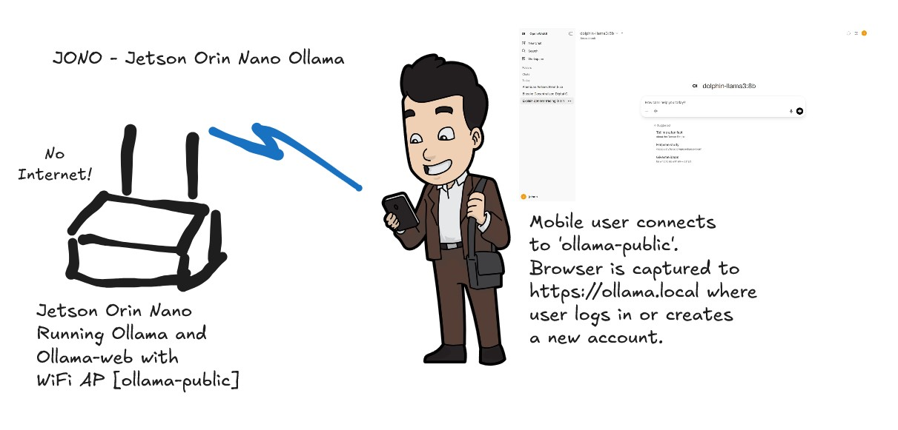
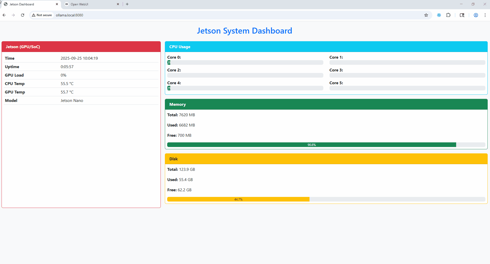
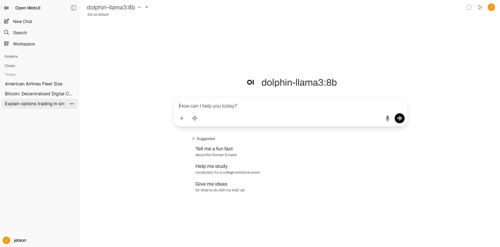
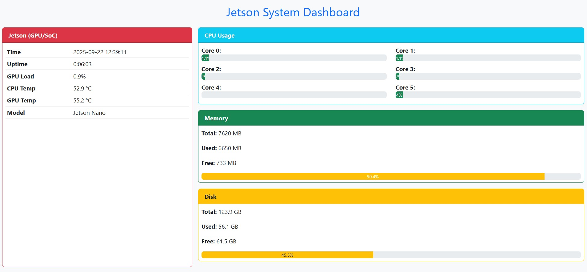

# JONO - Jetson Orin Nano Ollama - Offline AI Server + Dashboard


Have you ever wanted to have AI available when you were completely offline and no internet available?  Now you can create your own self contained AI Web Service and WiFi Portal!

JONO is a portable AI inference server for the Jetson Orin Nano, preconfigured with Ollama WebUI for model interaction and a Jetson System Dashboard for monitoring. Runs as a standalone Wi-Fi access point (ollama-public) for offline use in classrooms, campgrounds, and labs.  This device is preconfigured as a **portable AI inference server** for campgrounds, classrooms, or offline labs.  

It runs **Ollama** with a web UI for model interaction, and a **Jetson System Dashboard** for monitoring system health.   

### Offline Ollama in a small low power package!

---

### Speed and Stats

---

## ⚙️ Installation

This release ships as a ~35Gb compressed disk image download:  
**`jetson-ollama-1.1.img.gz`(https://st67014.ispot.cc/jetson-ollama-1.1.img.gz)**

The image is designed for **128 GB NVMe storage**. You will need:
- A Jetson Orin Nano Developer Kit
- A blank 128 GB (or larger) NVMe SSD installed in the M.2 slot
- A Linux or Windows host with imaging tools
- A way to write the `.img.gz` file (USB-to-NVMe adapter or direct NVMe slot)

### 1. Download the Image
Copy `jetson-ollama-1.1.img.gz` to your workstation.

### 2. Decompress the Image
On Linux:
```bash
gunzip jetson-ollama-1.1.img.gz
```

On Windows:  
Use [7-Zip](https://www.7-zip.org/) or similar to extract the `.img`.

### 3. Flash the Image

#### Linux (with `dd`)
Find the NVMe device:
```bash
lsblk
```
Example: `/dev/nvme0n1`

Write the image:
```bash
sudo dd if=jetson-ollama-1.1.img of=/dev/nvme0n1 bs=64M status=progress conv=fsync
```

⚠️ **Double-check your device path** (`/dev/nvme0n1`) — this will erase the entire drive.

#### Windows (with Balena Etcher)
1. Install [Balena Etcher](https://etcher.balena.io/).  
2. Select `jetson-ollama-1.1.img`.  
3. Select your 128 GB NVMe target.  
4. Flash and wait until it completes.

### 4. First Boot
1. Insert the NVMe into the Jetson Orin Nano.  
2. Power on the device.  
3. The system will auto-expand the filesystem on first boot.  
4. Default credentials:
   - **Username:** `jetson`  
   - **Password:** `jetson`

### 5. Access Services
- Connect to Wi-Fi SSID: **`ollama-public`**  
  Password: **`111111111`**
- Ollama WebUI: **https://ollama.local/**  (default IP is 10.10.10.1 if DNS isn't working)
  - **Admin:** `ollama` / `ollama`
- Jetson Dashboard: **http://ollama.local:8080**

### 6. Post-Install Notes
- Change the default passwords (`jetson`, `ollama`) before production use.  
- If you encounter boot issues, confirm the NVMe is 128 GB or larger.

---

## 📡 Network Access

The device acts as its own Wi-Fi Access Point (AP):

- **SSID:** `ollama-public`  
- **Password:** `111111111`  
- **Default Host IP:** 10.10.10.1

Connect your laptop, phone, or tablet to this SSID to access the services.
You will be given a DHCP address in the 10.10.10.0/24 network.

---

## 🔐 Default Credentials

### Linux Host (ssh)
- **Username:** `jetson`  
- **Password:** `jetson`  

### Ollama Web UI (https://ollama.local)
- **Username:** `ollama`  
- **Password:** `ollama`  

---

## 🌐 Services

- **Ollama Web UI:** [https://ollama.local](https://ollama.local)  
  (Access models, chat, and admin features)

- **Jetson System Dashboard:** [http://ollama.local:8080](http://ollama.local:8080)  
  (Monitor CPU, GPU, memory, disk, temps, and uptime)

---

## ⚙️ System Details

- Hardware: NVIDIA Jetson Orin Nano Developer Kit  
- Default user: `jetson`  
- Models installed: dolphin-llama3:8b (4.7Gb, uncensored) and tinyllama:1.1b (638Mb)
- Storage: 128 GB drive (~60 GB free at deployment)  

---

## 🔒 Firewall Rules

This image is preconfigured with **UFW (Uncomplicated Firewall)** to allow only the services required for operation.  
All other inbound connections are blocked by default.

### Allowed Services & Ports
- **SSH** – TCP 22 (for administration)
- **HTTP/HTTPS reverse proxy** – TCP 80/443 (Apache serving Ollama WebUI)
- **Jetson System Dashboard** – TCP 8080 (Jetson System Dashboard)
- **DHCP** – UDP 67 (dnsmasq hands out IP addresses on `ollama-public`)
- **DNS** – UDP/TCP 53 (dnsmasq provides local name resolution)
- **mDNS** – UDP 5353 (so `ollama.local` can resolve automatically on local network)

---

## 🛠️ Troubleshooting

### 1. Can’t connect to Wi-Fi (`ollama-public`)
- Ensure the AP service is running:
  ```bash
  sudo systemctl restart NetworkManager dnsmasq hostapd
  ```

### 2. Checking Firewall (UFW) Rules
Run:
```bash
sudo ufw status verbose
```

Expected output should include:
```
22/tcp ALLOW
80/tcp ALLOW
443/tcp ALLOW
8080/tcp ALLOW
67/udp ALLOW
53/tcp ALLOW
53/udp ALLOW
5353/udp ALLOW
```

### Resetting Rules (if broken)
If connectivity fails (e.g. clients cannot get DHCP or DNS):
```bash
sudo ufw --force reset
sudo ufw default deny incoming
sudo ufw default allow outgoing

# Re-add required rules:
sudo ufw allow 22/tcp     # SSH
sudo ufw allow 80/tcp     # HTTP
sudo ufw allow 443/tcp    # HTTPS
sudo ufw allow 8080/tcp   # Dashboard
sudo ufw allow 67/udp     # DHCP
sudo ufw allow 53/tcp     # DNS
sudo ufw allow 53/udp     # DNS
sudo ufw allow 5353/udp   # mDNS

sudo ufw enable
sudo ufw status verbose
```

### Firewall Notes
If you expose this server outside a local/private network, change all default passwords first.  
Additional services (e.g. custom APIs) must be explicitly opened in the firewall.

- Temporarily disable firewall for debugging:
  ```bash
  sudo ufw disable
  ```
- Re-enable afterwards:
  ```bash
  sudo ufw enable
  ```

## 📸 Screenshots

### Ollama Web UI


### Jetson System Dashboard


